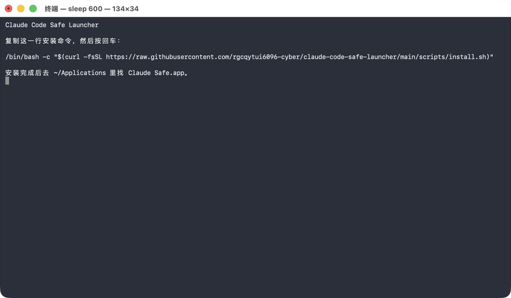
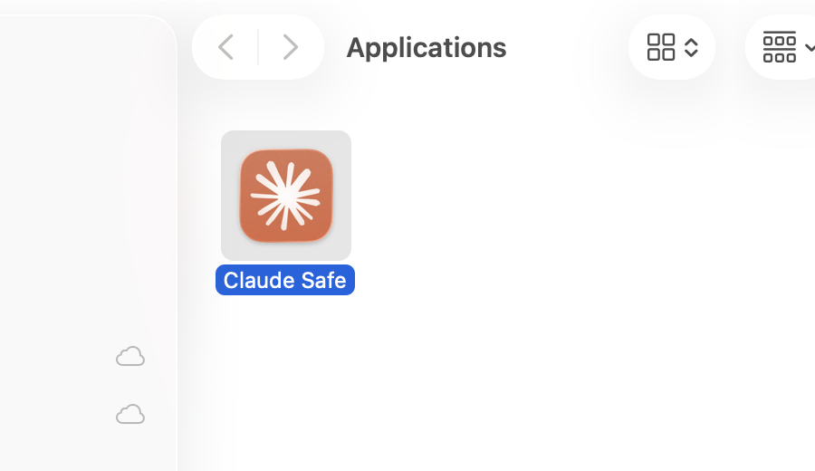
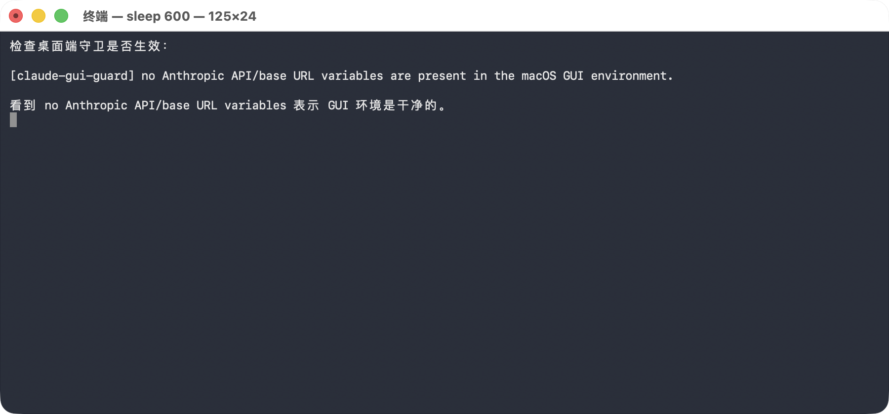

# Claude Code Safe Launcher

最近 Claude / Claude Code 封号很严重，很多用户开始检查本机环境变量、代理配置和第三方 provider key 有没有被 Claude 启动时静默继承。

这个项目给 Claude Code 终端版和 Claude 桌面端加一层启动前安全闸门：

**Claude 启动前先检查本机环境。检查不过，就不启动。**

它不修改 Claude 官方二进制，不破坏签名，不绕过账号、地区或服务商规则。它是本机启动防护，不是破解工具。

## 重要声明

加上这个工具，**不能保证你一定不会被封号**。

封号由 Anthropic / Claude 的服务策略、账号状态、支付信息、网络环境、使用行为等多种因素共同决定。这个项目只能减少一类风险：减少 Claude 在启动时继承异常 provider 变量、第三方 key 或本机路由变量的概率。

更准确地说：

- 它不是破解工具
- 它不绕过账号、地区或服务商规则
- 它不修改 Claude 官方二进制
- 它不能阻止所有网络侧、账号侧、风控侧判断
- 它只能帮你把本机启动环境清理得更干净

作者目前按这个方案使用，尚未被封号。但这只是个人使用状态，不构成保证。

## 作者和联系

作者：菊夏

邮箱：xiaoshi274521@gmail.com

- 小红书：火鸡科学家，号：95494353222
- X / Twitter：[@Orangek21865157](https://x.com/Orangek21865157)

## 快速安装

### 一行安装

打开“终端”，复制执行：

```bash
/bin/bash -c "$(curl -fsSL https://raw.githubusercontent.com/rgcqytui6096-cyber/claude-code-safe-launcher/main/scripts/install.sh)"
```



### 先下载再安装

如果你不想直接执行远程脚本，可以先下载仓库再运行：

```bash
git clone https://github.com/rgcqytui6096-cyber/claude-code-safe-launcher.git
cd claude-code-safe-launcher
bash scripts/install.sh
```

## macOS 桌面端图文步骤

这部分写给 Claude 桌面端用户。

如果你平时只是点 Dock 里的 Claude 图标，很少用终端版 Claude Code，也建议照着做。桌面端和终端版不是同一条启动路径，终端里的保护不一定会自动覆盖桌面端。

### 第一步：打开终端

在 macOS 上打开“终端”：

1. 按 `Command + 空格`
2. 输入“终端”或 `Terminal`
3. 回车打开

### 第二步：执行安装命令

复制执行：

```bash
/bin/bash -c "$(curl -fsSL https://raw.githubusercontent.com/rgcqytui6096-cyber/claude-code-safe-launcher/main/scripts/install.sh)"
```

安装脚本会自动完成：

- 给终端版 `claude` 加启动前检查
- 创建 `~/Applications/Claude Safe.app`
- 安装 `claude-gui-guard`
- 注册登录时自动清理 GUI 环境的 LaunchAgent
- 给 `Claude Safe.app` 使用原版 Claude 图标

### 第三步：找到 Claude Safe.app

安装完成后，打开 Finder：

1. 菜单栏点“前往”
2. 点“个人”
3. 打开 `Applications`
4. 找到 `Claude Safe.app`

它的位置是：

```text
~/Applications/Claude Safe.app
```



### 第四步：第一次启动

双击 `Claude Safe.app`。

如果检查通过，它会打开原版 Claude 桌面端。

如果检查失败，它会弹窗阻止启动。常见原因是 GUI 环境里仍然存在：

```text
ANTHROPIC_BASE_URL
ANTHROPIC_AUTH_TOKEN
ANTHROPIC_API_KEY
```

### 第五步：替换 Dock 图标

这一步很关键。

原版 `/Applications/Claude.app` 仍然可以直接打开，但直接点原版 Claude，会绕过“每次启动前检查”这一层。

建议这样做：

1. 从 Dock 里移除原来的 Claude 图标
2. 把 `~/Applications/Claude Safe.app` 拖到 Dock
3. 以后只从 Dock 里的 `Claude Safe.app` 启动 Claude

如果 Dock 图标没有立刻刷新，先把旧图标从 Dock 移除，再重新拖入 `Claude Safe.app`。必要时重新登录 macOS。

### 第六步：确认防护生效

打开终端，执行：

```bash
~/.local/bin/claude-gui-guard check
```

正常会看到：

```text
[claude-gui-guard] no Anthropic API/base URL variables are present in the macOS GUI environment.
```



## 终端版用户

安装后继续正常使用：

```bash
claude
```

启动前会自动检查：

```text
ANTHROPIC_BASE_URL
ANTHROPIC_AUTH_TOKEN
ANTHROPIC_API_KEY
```

只要其中任何一个存在，就直接拦截，不启动。

也可以测试拦截是否生效：

```bash
ANTHROPIC_BASE_URL=https://blocked.invalid claude --version
```

正常应该被拦截。

## 它挡什么

启动前拦截这些 Anthropic 相关变量：

```text
ANTHROPIC_BASE_URL
ANTHROPIC_AUTH_TOKEN
ANTHROPIC_API_KEY
```

启动 Claude 子进程前移除这些第三方 provider key：

```text
OPENROUTER_API_KEY
OPENAI_API_KEY
```

默认设置非必要流量/遥测关闭变量：

```text
CLAUDE_CODE_DISABLE_NONESSENTIAL_TRAFFIC=1
DO_NOT_TRACK=1
DISABLE_TELEMETRY=1
DISABLE_ERROR_REPORTING=1
DISABLE_AUTOUPDATER=1
```

这些变量是否全部生效，取决于 Claude 当前版本支持情况。不要把它们当成唯一的隐私保证。

## 安装后会放哪些文件

```text
~/.local/bin/claude
~/.local/bin/claude.unprotected
~/.local/bin/claude-gui-guard
~/Library/LaunchAgents/local.claude.safe-env.plist
~/Applications/Claude Safe.app
```

原版 `/Applications/Claude.app` 不会被修改。

## 如果启动失败

### 提示 `ANTHROPIC_BASE_URL is set`

说明你的 shell 或 macOS GUI 环境里还有 `ANTHROPIC_BASE_URL`。

如果你是官方订阅用户，一般不应该设置这个变量。先清掉它，再启动。

### 找不到 Claude Safe.app

重新运行安装命令：

```bash
/bin/bash -c "$(curl -fsSL https://raw.githubusercontent.com/rgcqytui6096-cyber/claude-code-safe-launcher/main/scripts/install.sh)"
```

然后检查：

```bash
ls -ld ~/Applications/Claude\ Safe.app
```

### 双击后没有反应

先在终端里手动检查：

```bash
~/.local/bin/claude-gui-guard check
```

如果检查失败，按提示清理环境变量。

如果检查成功，但仍然打不开，确认原版 Claude 是否存在：

```bash
ls -ld /Applications/Claude.app
```

## 卸载

如果你是一行命令安装的，用这个卸载：

```bash
/bin/bash -c "$(curl -fsSL https://raw.githubusercontent.com/rgcqytui6096-cyber/claude-code-safe-launcher/main/scripts/uninstall.sh)"
```

如果你是先下载仓库再安装的，进入项目目录执行：

```bash
bash scripts/uninstall.sh
```

卸载后会移除：

- `Claude Safe.app`
- `claude-gui-guard`
- 登录清理项
- 本项目安装的终端 wrapper

## 这个项目不能替你做什么

这不是完整沙箱。

它不会：

- 审计每一个网络请求
- 阻止所有 MCP 工具
- 改写 Claude 的系统提示词
- 修改 Claude 官方二进制
- 阻止你直接打开原版 `/Applications/Claude.app`
- 替你判断每一个 shell 命令是否安全

如果你需要更强防护，继续加：

- Claude Code permissions
- MCP deny rules
- sandbox
- 陌生 GitHub 仓库隔离环境
- 不自动执行未知安装脚本
- 不把数据库连接、SSH key、生产环境密钥暴露给 AI 工具

## 相关资料

- Anthropic docs: [environment variables](https://code.claude.com/docs/en/env-vars)
- Anthropic docs: [data usage](https://code.claude.com/docs/en/data-usage)
- Anthropic docs: [permissions](https://code.claude.com/docs/en/permissions)
- Anthropic docs: [sandboxing](https://code.claude.com/docs/en/sandboxing)
- GitHub Advisory: [GHSA-jh7p-qr78-84p7](https://github.com/anthropics/claude-code/security/advisories/GHSA-jh7p-qr78-84p7)

## License

MIT
