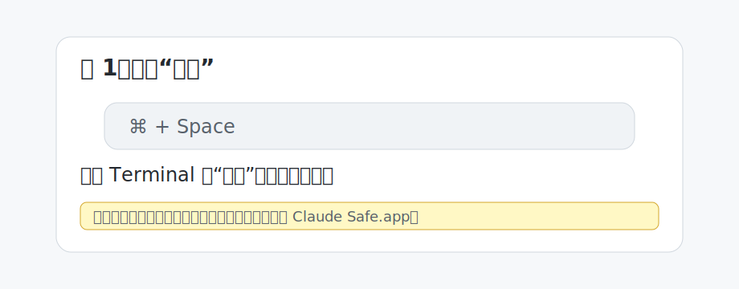
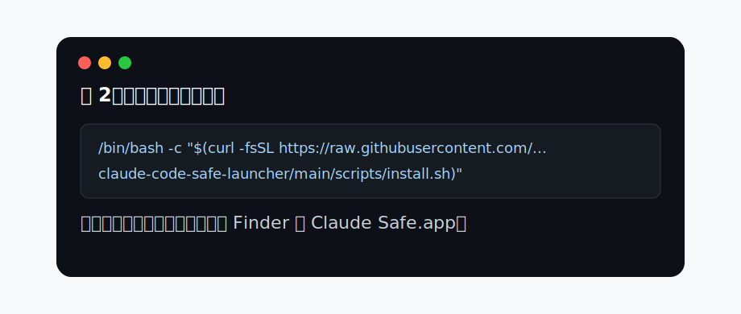
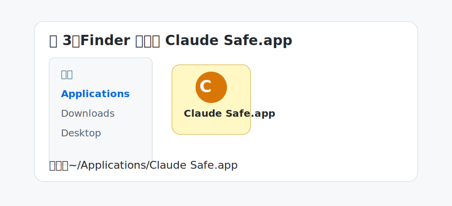
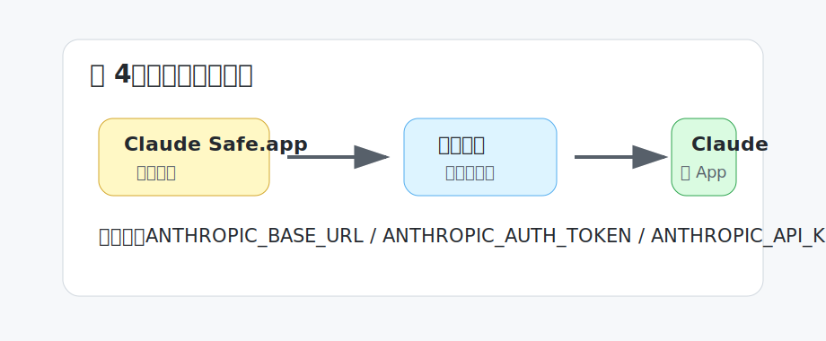
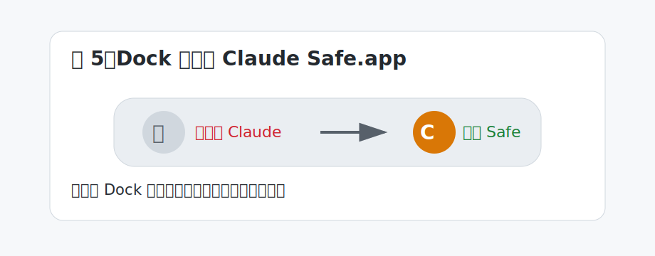

# macOS 桌面端图文安装教程

这份教程主要写给 **Claude 桌面端用户**。

如果你平时只是点 Dock 里的 Claude 图标，很少用终端版 Claude Code，也建议看完这一页。因为桌面端和终端版不是同一条启动路径，终端里的保护不一定会自动覆盖桌面端。

## 背景

最近社区集中讨论了 Claude Code 的本地环境识别问题。

Claude Code 这类工具和普通聊天 App 不一样。它可以读取文件、运行命令、修改仓库、调用 MCP、连接浏览器和数据库工具。也就是说，它能接触到很多本机上下文。

在这种情况下，启动时继承了什么环境变量，就变得很重要。

比如这些变量：

```text
ANTHROPIC_BASE_URL
ANTHROPIC_AUTH_TOKEN
ANTHROPIC_API_KEY
OPENROUTER_API_KEY
OPENAI_API_KEY
```

它们可能影响请求走向、鉴权方式、provider 路由，或者让 Claude 进程拿到本来不该给它的第三方 key。

这个项目的目的很简单：

**在 Claude 启动之前，先做一次本机环境检查。检查不过，就不启动。**

## 重要声明

加上这个工具，**不能保证你一定不会被封号**。

封号由 Anthropic / Claude 的服务策略、账号状态、支付信息、网络环境、使用行为等多种因素共同决定。这个项目只能减少一类风险：减少 Claude 在启动时继承异常 provider 变量、第三方 key 或本机路由变量的概率。

更准确地说：

- 它不是破解工具
- 它不绕过账号、地区或服务商规则
- 它不修改 Claude 官方二进制
- 它不能阻止所有网络侧、账号侧、风控侧判断
- 它只能帮你把本机启动环境清理得更干净

作者目前按这个方案使用，尚未被封号。但这只是个人使用状态，不构成保证。

## 安装后的效果

安装完成后，你的电脑里会多一个新的安全入口：

```text
~/Applications/Claude Safe.app
```

以后桌面端不要再点原来的 Claude 图标，改点 `Claude Safe.app`。

它会先检查本机 GUI 环境。检查通过后，再打开原版：

```text
/Applications/Claude.app
```

原版 Claude.app 不会被修改。

## 第一步：打开终端

在 macOS 上打开“终端”：

1. 按 `Command + 空格`
2. 输入“终端”或 `Terminal`
3. 回车打开



## 第二步：复制一行安装命令

在终端里复制执行下面这行：

```bash
/bin/bash -c "$(curl -fsSL https://raw.githubusercontent.com/rgcqytui6096-cyber/claude-code-safe-launcher/main/scripts/install.sh)"
```



安装脚本会自动完成：

- 给终端版 `claude` 加启动前检查
- 创建 `~/Applications/Claude Safe.app`
- 安装 `claude-gui-guard`
- 注册登录时自动清理 GUI 环境的 LaunchAgent
- 给 `Claude Safe.app` 使用原版 Claude 图标

## 第三步：找到 Claude Safe.app

安装完成后，打开 Finder：

1. 菜单栏点“前往”
2. 点“个人”
3. 打开 `Applications`
4. 找到 `Claude Safe.app`

它的位置是：

```text
~/Applications/Claude Safe.app
```



## 第四步：第一次启动

双击 `Claude Safe.app`。

如果检查通过，它会打开原版 Claude 桌面端。

如果检查失败，它会弹窗阻止启动。常见原因是 GUI 环境里仍然存在：

```text
ANTHROPIC_BASE_URL
ANTHROPIC_AUTH_TOKEN
ANTHROPIC_API_KEY
```



## 第五步：替换 Dock 图标

这一步很关键。

原版 `/Applications/Claude.app` 仍然可以直接打开，但直接点原版 Claude，会绕过“每次启动前检查”这一层。

所以建议：

1. 从 Dock 里移除原来的 Claude 图标
2. 把 `~/Applications/Claude Safe.app` 拖到 Dock
3. 以后只从 Dock 里的 `Claude Safe.app` 启动 Claude



如果 Dock 图标没有立刻刷新，先把旧图标从 Dock 移除，再重新拖入 `Claude Safe.app`。必要时重新登录 macOS。

## 第六步：确认防护生效

打开终端，执行：

```bash
~/.local/bin/claude-gui-guard check
```

正常会看到：

```text
[claude-gui-guard] no Anthropic API/base URL variables are present in the macOS GUI environment.
```

如果你也使用终端版 Claude Code，可以再执行：

```bash
claude --version
```

如果能显示 Claude Code 版本，说明终端 wrapper 能找到原始 Claude。

还可以测试拦截是否生效：

```bash
ANTHROPIC_BASE_URL=https://blocked.invalid claude --version
```

正常应该被拦截。

## 如果启动失败

### 提示 `ANTHROPIC_BASE_URL is set`

说明你的 shell 或 macOS GUI 环境里还有 `ANTHROPIC_BASE_URL`。

如果你是官方订阅用户，一般不应该设置这个变量。先清掉它，再启动。

### 找不到 Claude Safe.app

重新运行安装命令：

```bash
/bin/bash -c "$(curl -fsSL https://raw.githubusercontent.com/rgcqytui6096-cyber/claude-code-safe-launcher/main/scripts/install.sh)"
```

然后检查：

```bash
ls -ld ~/Applications/Claude\ Safe.app
```

### 双击后没有反应

先在终端里手动检查：

```bash
~/.local/bin/claude-gui-guard check
```

如果检查失败，按提示清理环境变量。

如果检查成功，但仍然打不开，确认原版 Claude 是否存在：

```bash
ls -ld /Applications/Claude.app
```

## 卸载

如果你是一行命令安装的，用这个卸载：

```bash
/bin/bash -c "$(curl -fsSL https://raw.githubusercontent.com/rgcqytui6096-cyber/claude-code-safe-launcher/main/scripts/uninstall.sh)"
```

如果你是先下载仓库再安装的，进入项目目录执行：

```bash
bash scripts/uninstall.sh
```

卸载后会移除：

- `Claude Safe.app`
- `claude-gui-guard`
- 登录清理项
- 本项目安装的终端 wrapper

## 作者和联系

作者：菊夏

邮箱：xiaoshi274521@gmail.com

其他联系方式：

- GitHub：
- 小红书：
- 公众号：
- X / Twitter：

如果你遇到安装失败、桌面端打不开、Dock 图标不刷新，可以把系统版本、Claude 版本和报错截图一起发来。

## 更强防护

这个项目只是启动前闸门，不是完整沙箱。

如果你经常打开陌生仓库，建议继续配置：

- Claude Code permissions
- MCP deny rules
- sandbox
- 容器或虚拟机
- 禁止自动执行未知安装脚本
- 不把数据库连接、SSH key、生产环境密钥暴露给 AI 工具
